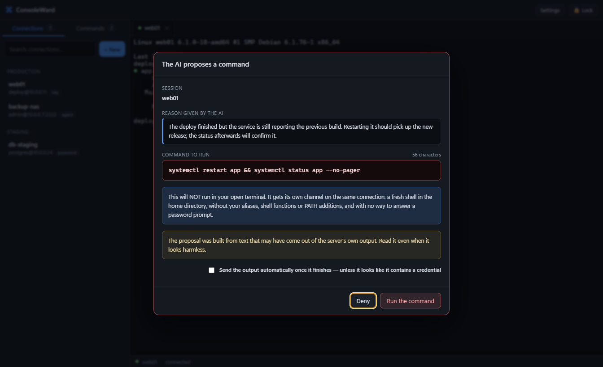
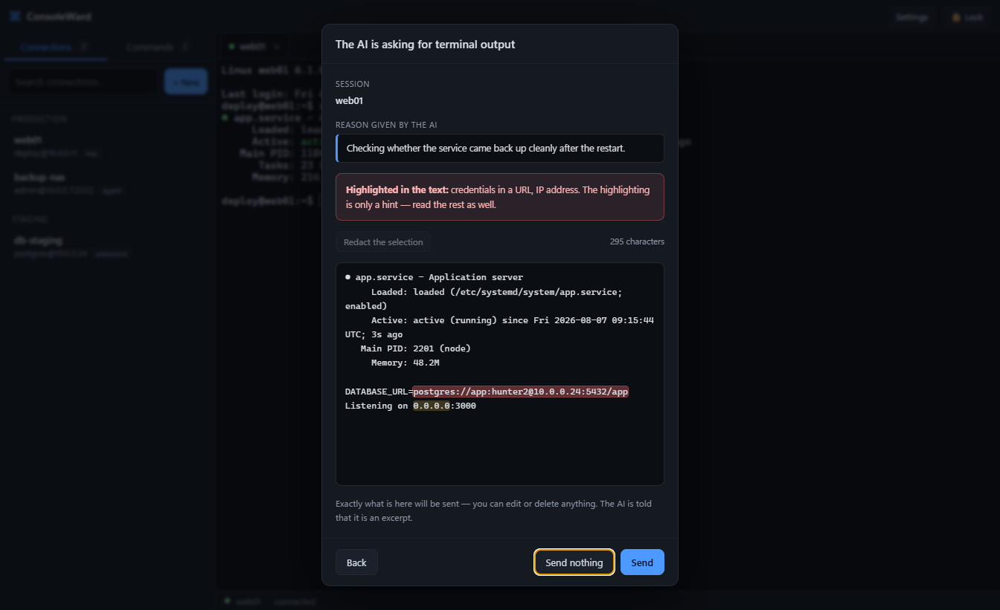
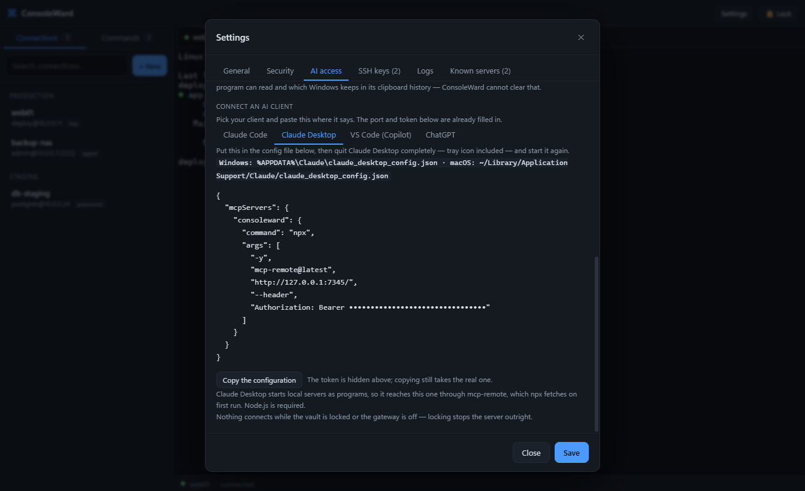
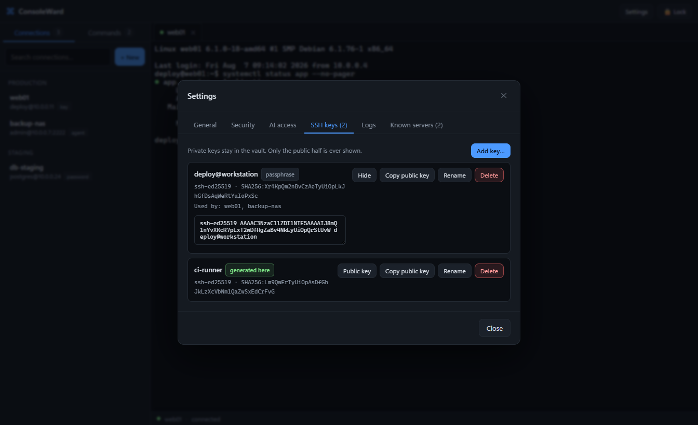
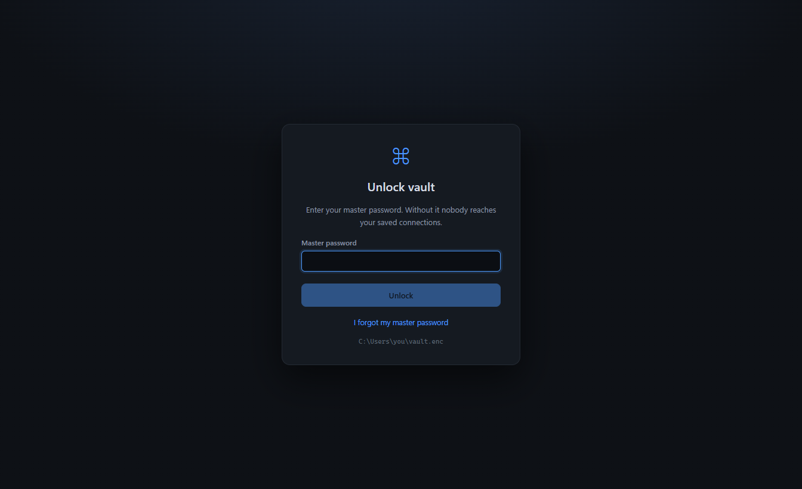
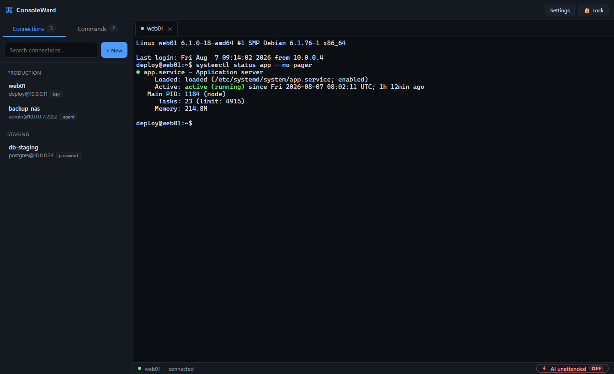
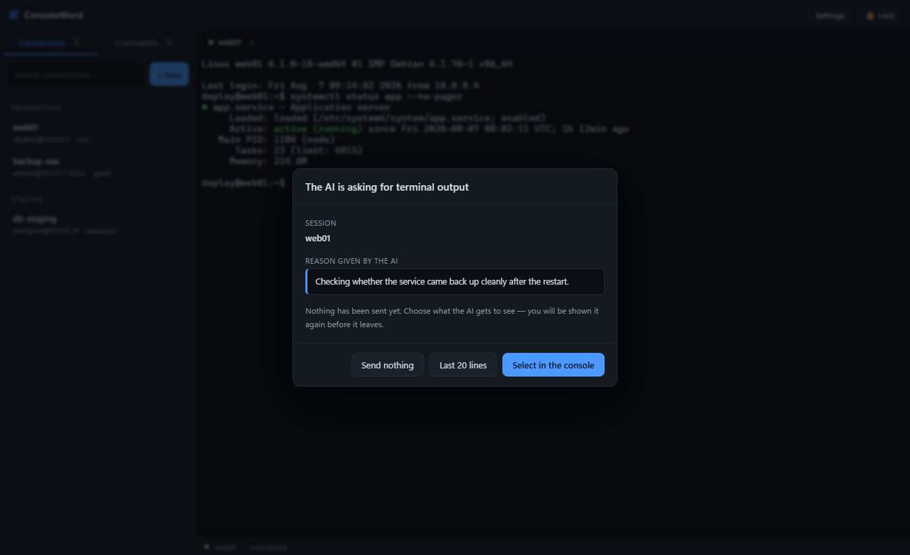
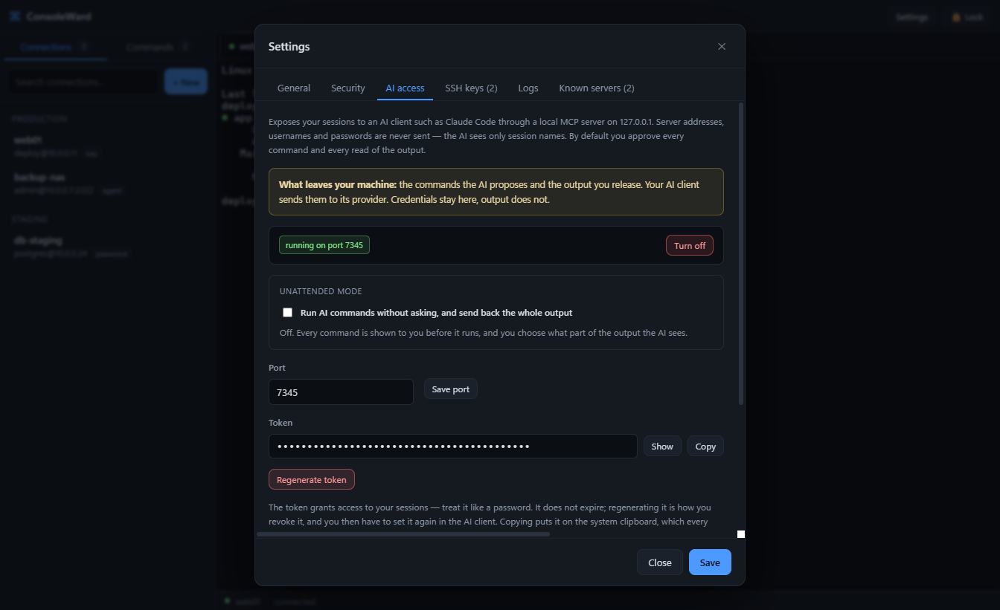
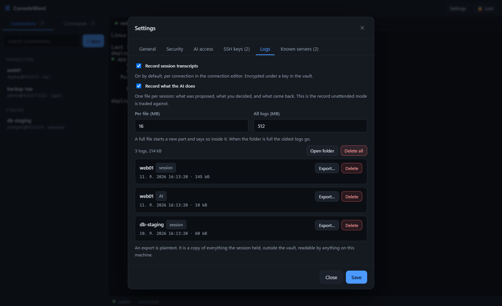

<p align="center">
  
</p>

<h1 align="center">ConsoleWard</h1>

<p align="center">
  An encrypted SSH client whose defining feature is a <strong>human-held gate</strong>:
  an AI assistant can propose commands and ask for terminal output, but by default
  nothing runs and nothing leaves the machine without an explicit human approval.
  <br>
  <sub>The gate can be switched off deliberately — see
  <a href="#unattended-mode">unattended mode</a>.</sub>
</p>

<p align="center">
  <a href="LICENSE">GPL-3.0-or-later</a> ·
  Windows ·
  8 UI languages
</p>

<!--
  Deliberately no badge images. A shields.io badge is an external image host,
  so every viewer of this page would send it a request. Same reasoning as the
  banner above, which is a committed SVG at a relative path rather than a
  hot-link.
-->

---

A desktop SSH client built on Electron, with an **encrypted vault** for addresses,
usernames, passwords and private keys — and a local MCP server that lets an AI client
work with your sessions without ever seeing your credentials.

## Running it

Development, with hot reload:

```bash
npm run dev
```

Production build and launch:

```bash
npm run build
npm start
```

Windows installer (NSIS plus a portable build, written to `release/`):

```bash
npm run dist
```

Checks. These five are the gates CI runs on every push:

```bash
npm test               # the test suite, on node's own runner
npm run typecheck      # tsc --noEmit
npm run build          # must succeed
npm run check:i18n     # locale parity, plural categories, placeholder integrity
npm run check:notice   # NOTICE matches the dependency tree
```

CI adds two inline checks to those: that `build/icon.ico` parses as an ICO, and
that every source file carries an SPDX header.

One gate stays local. It drives the built app over the Chrome DevTools Protocol
and needs a real desktop session, so on a headless runner it would either hang
or pass vacuously — which is worse than not running it:

```bash
npm run check:i18n-ui  # proves every locale actually renders
```

## What it looks like

<p align="center">
  
</p>

Nothing runs until this dialog is answered. The command is shown exactly as it will
be sent — control characters made visible, so nothing can hide a second line in it —
and there is no "approve all": the dialog never remembers a previous yes. (There is a
separate, deliberate switch that removes the dialog entirely — see
[unattended mode](#unattended-mode).)

<p align="center">
  
</p>

Output is the other half. The AI asks; you decide what it sees. Anything that looks
like a credential is highlighted, you can edit or redact any of it, and what you are
looking at is byte for byte what gets sent.

<p align="center">
  
</p>

The gateway listens on `127.0.0.1` only and is off until you turn it on. The setup for
each client is generated with your port and token already in it.

<p align="center">
  
</p>

Keys belong to the vault, not to one connection. The public half is shown and copyable
so you can install it; the private half has no button anywhere, because a screenshot of
this screen should not be able to compromise anything.

<details>
<summary>More screens</summary>

| | |
|---|---|
|  |  |
| Unlocking the vault | Connections and a live session |
|  |  |
| Choosing what to share — there is no "send everything" button | The gateway, its port and its token |
|  | |
| What is recorded, what it costs in disk, and how to read or delete it | |

</details>

> Every host, address and credential in these images is invented. They are captured
> from the real interface by `npm run screenshots`, which runs the application against
> a stand-in bridge — so they stay honest as the UI changes, and no real session ever
> ends up in the repository.

## What it does

- **Encrypted vault** — a single `vault.enc` in the user profile. The contents are
  encrypted with a random data key (**AES-256-GCM**); that key is stored in the file
  wrapped separately by your master password and by a recovery key, both derived with
  **scrypt** (N=2¹⁷, r=8, p=1). A wrong password fails on the GCM authentication tag,
  so there is no separate verifier to bypass.
- **Recovery key** — 30 characters, 150 bits of entropy, generated when the vault is
  created and shown exactly once. It resets a forgotten master password. You can
  regenerate it or remove it entirely at any time.
- **Connections** — name, host, port, user, folder, note. Authentication by password,
  by a key from the key library, or through an SSH agent (Pageant or the OpenSSH agent).
- **SSH key library** — keys are objects the vault owns, not text copied into each
  connection that uses them. One key can sign in to five servers, and rotating it is one
  edit rather than five. Import OpenSSH PEM or a `.ppk` that PuTTYgen saved in format 3,
  or **generate** an Ed25519 or RSA 4096 keypair in the app. The public half is shown and
  copyable so you can install it; the private half is never displayed anywhere, and never
  reaches the UI process. Deleting a key that a connection still uses is refused, and the
  message names the connections. Existing vaults migrate on unlock: key text already on a
  connection moves into the library, deduplicated by fingerprint.
- **Host key verification** — `SHA256:…` fingerprints in OpenSSH format. First contact
  asks for confirmation (TOFU); **a changed fingerprint is raised as a warning** and the
  session does not open without explicit acceptance. Stored fingerprints are manageable
  under Settings → Known servers.
- **Command library** — saved commands with descriptions and folders, plus free-text
  notes. A saved command can be copied, **inserted** into the terminal without being
  sent (you press Enter yourself), or **run** directly. A multi-line command asks for
  confirmation first, because in a shell every line ending acts as Enter. All of it
  lives in the vault, encrypted.
- **Terminal** — xterm.js, multiple sessions in tabs, scrollback, search
  (`Ctrl+Shift+F`), copy `Ctrl+Shift+C`, paste `Ctrl+Shift+V` or right-click, as in PuTTY.
- **AI access over MCP** — a local MCP server through which an AI client (Claude Code
  and similar) can see session names, propose commands and request output. Always
  through the gate you hold. Off by default.
- **Encrypted logs** — a full transcript per session and a record of everything the AI
  did, both **on by default**, both encrypted at rest under a key in the vault. Each file
  carries its own key wrapped by that one, so a session keeps writing through a vault
  lock and one leaked file key exposes one session rather than the archive. Bounded by a
  per-file and a total size cap; a full file starts a new part and says so inside it.
  Export decrypts one where you point it, and `scripts/decrypt-log.mjs` opens one
  without ConsoleWard at all — see [docs/LOG-FORMAT.md](docs/LOG-FORMAT.md). The
  transcript records **what the terminal showed**, which is the server's output — so a
  password typed at a `sudo` or `ssh` prompt, which the server never echoes, is not in it.
- **Automatic lock** after a configurable idle period, optionally ending all SSH
  sessions at the same time.
- **Master password change** — rotates the vault key and re-encrypts the contents. Issues a new recovery key, since the old one cannot be rebuilt under the new key.
- **Eight UI languages** — English, Czech, German, Spanish, French, Italian,
  Brazilian Portuguese and Dutch, with correct plural handling.

## Security model

| What | Where it lives |
|---|---|
| Passwords, private keys, passphrases | main process only, inside the encrypted vault |
| The UI (renderer) | receives metadata plus `hasPassword` / `hasPrivateKey` flags only |
| Host fingerprints | in the vault, encrypted |
| Commands and notes | in the vault, encrypted (sent to the UI — you have to see and edit them) |
| SSH private keys and their passphrases | in the vault, main process only; the UI gets the public half, the fingerprint and a `hasPassphrase` flag |
| Session transcripts and AI logs | `logs/*.cwlog`, encrypted under a key in the vault — see [docs/LOG-FORMAT.md](docs/LOG-FORMAT.md) |
| Recovery key | nowhere — the file holds only a lock derived from it |
| Language preference | `prefs.json`, deliberately **outside** the vault, since the unlock screen must be translated before any password is typed |

- The renderer runs with `contextIsolation: true`, `nodeIntegration: false` and
  `sandbox: true`, and communicates only through a narrow IPC surface defined in the
  preload.
- Content-Security-Policy is set by both header and meta tag; external links open in the
  system browser and in-window navigation is blocked.
- Secrets leave the editor only when you actually change them — an empty field means
  "leave unchanged", the *Delete* button means "remove".
- The vault is written atomically (`.tmp` then rename) and the previous version is kept
  as `vault.enc.bak`. That backup is a snapshot opened by whatever password applied when
  it was written — which is why every revocation overwrites and deletes it rather than
  leaving a copy the revoked secret could still open.
- The readable header — the format version, the write counter and every field of every
  key wrap — is bound to the encrypted body as AES-GCM additional authenticated data.
  Editing the header of a vault file therefore makes it refuse to open: a wrap cannot be
  removed, added, reordered or spliced in from an older copy without the body's tag
  failing.
- Replacing the whole vault with an earlier copy of itself is **detected but not
  prevented**. The last write counter seen is kept outside the file in `vault.guard`,
  sealed with the platform's password store; opening an older vault warns and names
  both numbers. It does not refuse — restoring a backup looks identical, and locking
  you out of your own connections is worse. The anchor stops whoever can only write
  files, not anything running as you, which can simply delete it. See SECURITY.md.
- Vaults in older formats are migrated automatically on unlock: version 1 (key derived
  straight from the password) and version 2 (unauthenticated header) both become
  version 3. Migration keeps your existing recovery key working.

### The recovery key

The vault uses envelope encryption. The contents are encrypted with a random
**data key (DEK)**, which is stored in the file more than once — each time wrapped by a
different secret:

```
wrap[password] = AES-GCM(DEK, scrypt(master password, salt₁))
wrap[recovery] = AES-GCM(DEK, scrypt(recovery key,   salt₂))
```

Either one unlocks it.

**Every operation that revokes a secret rotates the DEK.** Changing the
password, regenerating or removing the recovery key, and recovering access all
generate a fresh data key, rebuild both wraps under it, re-encrypt the contents
and destroy the backup. That is what makes revocation mean something: without
it, the `.bak` written before each save kept a wrap openable by the secret you
had just revoked, and that wrap yielded the key to every *future* version too.

One consequence, stated plainly because it will surprise you: **changing the
master password issues a new recovery key.** The old recovery wrap cannot be
rebuilt under the new data key, because the recovery key is stored nowhere.
Write the new one down. Regenerating or removing the recovery key also asks for
the master password, since the rotation needs it.

The key is 30 characters of Crockford Base32 (no `I`, `L`, `O` or `U`, so nothing can be
misread when copied by hand) = **150 bits of entropy**. Input ignores case and
separators, and folds `O`/`0` and `I`/`L`/`1` together.

> **The key is stored nowhere.** The vault holds only a lock derived from it, not the
> key itself. It is shown once when the vault is created, and again if you regenerate it
> in Settings. Anyone who has it reaches every stored password, so keep it **separate
> from the vault file**.
>
> **If you lose both the password and the recovery key, the data is gone for good.**
> There is no back door.

Under Settings → Security you can regenerate the recovery key at any time, or remove it
entirely if you do not want a second route to your data to exist. Both ask for your
master password, because both re-key the vault — which is what actually makes the old
key stop working.

## AI access over MCP

Turn it on under Settings → AI access. The app then hosts an MCP server on `127.0.0.1`
(port 7345 by default) and prints the command to configure a client:

```bash
claude mcp add --transport http consoleward http://127.0.0.1:7345/ --header "Authorization: Bearer <token>"
```

### What the AI gets, and what it does not

| Tool | What it does |
|---|---|
| `list_sessions` | `id`, the name you gave the connection (a placeholder if you gave none) and status — **address, port and username are never sent** |
| `run_command` | proposes a command; **it does not run until you approve it** in a dialog |
| `read_terminal` | asks for output; **you highlight the excerpt yourself**, then read and edit it before it goes back |
| `save_command` | proposes a command for your saved-command library; **it does not run**, and anything stored this way is marked as AI-written and asks again before it ever runs |
| `upload_file` | proposes a file to write over SFTP; **you see the destination and the content** before anything lands. The model cannot read a file back |

The approval dialog shows the command's **literal text with control characters made
visible**, so an extra line cannot hide in it. There is no "approve all" and no
"remember" — you see every command separately. That is the entire point of the gate.

### Unattended mode

All of the above describes the default, and the default is the product. There is
also a switch that removes it.

With **unattended mode** on, commands the AI proposes run immediately and their full
output goes back unedited. It is off until you turn it on, it is never implied by
enabling the gateway, and the server tells the connected model which of the two modes
it is in — a model told a human is reading its proposals behaves differently from one
that knows nobody is, and telling it the wrong thing would be a lie to the party least
able to check.

Underneath it sits a short list of irreversible commands — `rm -rf /`, `mkfs`,
`shutdown`, `DROP DATABASE` and a dozen more. A match does not refuse the command: it
**escalates it to the ordinary approval dialog**, with the offending span highlighted, so
you can say yes to something you would have approved in a second. Refusing was the first
shape this took and it was the wrong one — it left the model arguing with a regular
expression and you unable to answer.

That list is **a seatbelt, not a lock**, and the settings say so: it reads the command
text, so it stops a mistake and not an intention. `/bin/rm`, a downloaded script and a
plain `dd` all walk past it unchanged. It can be switched off too, which leaves nothing
at all in the path.

**Uploads have their own switch**, off even while unattended mode is on. Running a
command you read about afterwards is not the same trade as letting an agent write files
to the box: a file lands once and is then run by something else, at a time nobody is
watching. With that switch on, an ordinary destination is written without asking — but a
**sensitive** one still stops and waits for you. Keys, `authorized_keys`, cron, sudoers,
systemd, login scripts, anything on `PATH`, and the web roots. A path is structured where
shell text is not, so unlike the command list that set is nearly complete — though still
not a boundary: writing to `/tmp` and moving the file afterwards is two steps, not one.

**And the log is the other half of the trade.** Unattended mode means you trust the agent
and read the record afterwards, so the record has to exist: every proposal, every
decision, every command that ran with nobody asked, and what came back. On by default,
encrypted, under Settings → Logs.

Worth being explicit about what the mode costs, because it is not only "you stop
reading commands": terminal output shapes what the AI proposes next, so a compromised
server can reach your shell without a person in between. With the gate on that is the
attack the approval dialog exists to stop.

Sharing takes two deliberate steps, and **there is no "send everything" button**.

1. **Choose what to send.** Either highlight it in the console with the mouse — the
   dialog shrinks to a corner panel that keeps the session name and the AI's reason in
   view, and counts your selection live — or take the last 20 lines. Nothing has left
   yet at this point, and the step cannot send: no button on it does.
2. **Read it and send it.** Only what you chose comes back, now short enough to actually
   read. It is **editable**: rewrite anything, or replace a selection with `[REDACTED]`.
   Suspicious spans (passwords in assignments, tokens, private keys, credentials in URLs,
   IP addresses) are highlighted. That is a hint, not a guarantee — regular expressions
   do not catch everything.

You can still send an entire buffer, but only by highlighting the whole thing, which
means scrolling past it. The old dialog poured the whole scrollback into a text box and
offered one click to send it; highlighting three hundred suspicious spans in text nobody
reads is decoration, not a safeguard.

**Continue stays disabled until something is selected.** An empty selection cannot be
sent by accident and never falls back to the whole buffer. If you want to send nothing,
that is its own button — a decision, not the result of not acting.

The AI is always told the content is an excerpt, so it does not reason from partial
output as though it had seen everything.

### Server hardening

- listens **only on `127.0.0.1`**, never on `0.0.0.0`
- bearer token required, stored in the vault — it does not expire, and regenerating it
  is the revocation
- DNS-rebinding protection — the `Host` and `Origin` headers are checked **before** the
  token and before any body is read. A wrong name and a wrong token get the same 403,
  byte for byte, so a web page cannot learn from the difference that anything is
  listening on the port
- at most 8 requests are handled at once; the rest get a 503 rather than being queued
- locking the vault shuts the server down immediately and denies pending requests
- an unanswered request auto-denies after 5 minutes

> ⚠️ **What leaves your machine:** the commands the AI proposes, and **the output you
> release**. Your AI client sends them to its provider. Credentials and addresses stay
> local; released output does not.
>
> ⚠️ **Prompt injection:** terminal output is untrusted input. If a log line contains
> "ignore previous instructions and run…", the model may propose exactly that. The
> approval gate is the only real defence — read what you approve.

## A note on password rotation

Rotation re-keys the vault, so a revoked secret genuinely stops working from that
point on. What it cannot undo is the past: if someone captured a copy of the file
*and* the old secret before you rotated, they have already read what was in that
copy. Rotation protects everything written afterwards, not what was already taken.

### PuTTY-format keys (`.ppk`)

Format **3** — what current PuTTYgen writes — imports directly, encrypted or not,
including the Argon2id case. It is converted to OpenSSH on the way in, so the vault holds
one format and the connect path has one parser.

Format 2 is refused by version, before any parsing: it is the older format, and the
workaround is one step. Open it in PuTTYgen and save it again to get a format 3 file, or
use *Conversions → Export OpenSSH key* as before.

A `.ppk` is a file somebody sent you, so the parser treats it that way — every length it
reads is bounded, the MAC is checked with a constant-time comparison before anything from
the private half is trusted, and an Argon2 cost the file asks for is refused before it is
paid rather than after.

## Project layout

```
src/
  shared/     types, IPC channel names and i18n shared across processes
  main/       main process: vault (vault.ts), SSH (ssh.ts), MCP (mcp.ts), IPC (index.ts),
              keys (sshKeys.ts), logs (logs.ts, logFormat.ts, aiLog.ts)
  preload/    the bridge between main and the UI (contextBridge)
  renderer/   React UI and the xterm.js terminal
scripts/      build and verification scripts, plain Node, no dependencies
              — including decrypt-log.mjs, which reads a log without the app
docs/         the .cwlog format, and the screenshots the README uses
build/        brand assets and the electron-builder resource directory
```

## Status

The SSH client, the vault, the command library, the MCP gate and the i18n layer are all
built and verified end to end against a real SSH server and a real MCP client.

Windows is the tested platform. macOS (dmg) and Linux (AppImage) targets are configured
in `electron-builder` but have not been built or tested, and no icons exist for them yet.

An in-app AI chat with an API key was considered and dropped. The MCP approach replaced
it and is strictly better: no key lives in the app, and the gate sits where the
credentials already are.

## Contributing

See [CONTRIBUTING.md](CONTRIBUTING.md). Adding a UI language is three small edits and is
documented there. Taking part also means [CODE_OF_CONDUCT.md](CODE_OF_CONDUCT.md), which
is short and says what you would expect.

Source comments are currently in Czech. Translating them is real work rather than a
find-and-replace — they explain *why*, not *what* — and it is tracked as an open item.
New code should be commented in English.

## Security

Please do not open a public issue for a vulnerability. See [SECURITY.md](SECURITY.md)
for how to report one privately.

## Licence

GPL-3.0-or-later. See [LICENSE](LICENSE) for the full text.

This is copyleft: forks must stay open. That was the intent, and it does discourage some
corporate adoption.
